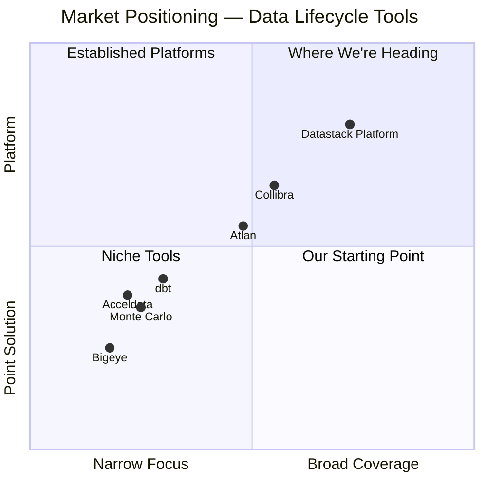
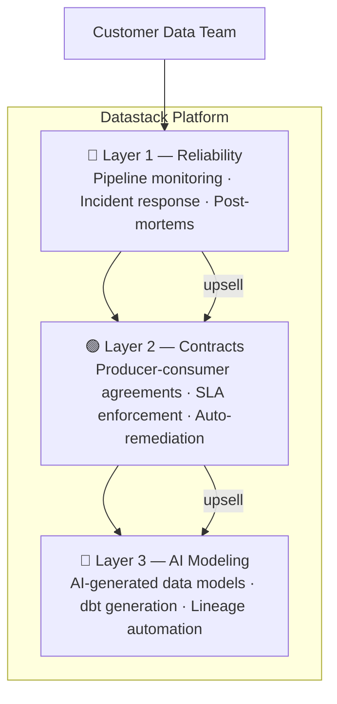
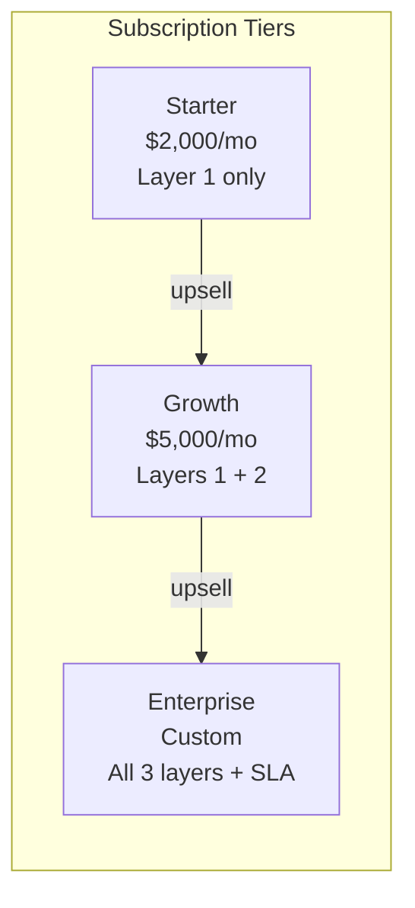

# Datastack Platform — Executive Overview

> A modular, end-to-end platform for the data lifecycle.
> Built for data engineering teams who are tired of duct-taping point solutions together.

---

## The Problem

Modern data engineering is broken at a fundamental level — not because individual tools are bad, but because **no single platform owns the full lifecycle**.

Every data team faces the same recurring nightmare:

- **Pipelines fail silently.** Nobody knows until an analyst screams.
- **There are no formal agreements** between who produces data and who consumes it.
- **Every company rebuilds the same infrastructure from scratch** — ingestion, modeling, quality checks, lineage, incident response.
- **Existing tools solve one layer.** The gaps between them are where the real pain lives.

The result? Data engineers spend the majority of their time on plumbing, not insights. And when something breaks, it's chaos.

---

## The Opportunity

The global data quality and observability market is growing rapidly, but it remains fragmented. Companies like Monte Carlo, Bigeye, and Acceldata solve *monitoring*. dbt solves *transformation*. Collibra and Atlan solve *governance*. Nobody has connected the dots into a coherent, end-to-end platform.

**That's the gap we're building for.**

---

## Our Solution — A 3-Layer Platform

We are building a modular platform that covers the entire data lifecycle. Customers can adopt one module at a time or all three, making the sales motion flexible and the platform sticky.

### Layer 1 — Data Reliability Platform *(Build First)*

> *"PagerDuty for your data pipelines."*

When a data pipeline breaks, the current experience is chaos: a Slack ping, frantic digging through logs, nobody sure who owns the problem, no post-mortem. We fix that.

**What it does:**
- Monitors pipelines across Airflow, dbt, Snowflake, and more
- Detects anomalies and data quality issues automatically
- Auto-triages the root cause (source issue? schema drift? transformation bug?)
- Routes incidents to the right owner with full context
- Tracks resolution and generates post-mortems

**Why lead with this:** Pain is acute, visible, and felt *right now*. Easiest to sell. Fastest path to revenue.

---

### Layer 2 — Data Contract Platform *(Activate After Layer 1)*

> *"A formal handshake between every data producer and consumer."*

Today, data producers publish data with no guarantees. Consumers consume it with no protection. When something breaks, nobody knows who's responsible.

**What it does:**
- Defines contracts between producers and consumers (schema, SLA, freshness, ownership)
- Auto-generates tests from contract definitions
- Monitors compliance continuously
- Alerts and auto-remediates violations

---

### Layer 3 — AI Data Model Generator *(Activate After Layer 2)*

> *"Describe your business goal. Get a production-ready data model."*

Every new data project starts the same way — weeks of understanding sources, designing models, writing SQL, documenting lineage. It's pattern-matching work that AI should be doing.

**What it does:**
- Connects to your data sources
- Takes a plain-language business goal as input
- Proposes a data model, generates dbt/SQL transformations
- Maps lineage automatically and flags quality risks before deployment

---

## Business Model

- **Pricing model:** Monthly subscription, per-tier access
- **Sales motion:** Bottom-up — land with Layer 1, expand via upsell
- **Target customer:** Mid-market data teams (regional hospital networks, financial services, SaaS companies)
- **Contract size:** $24K–$60K ARR per customer to start, growing with upsells

---

## Why Now

1. **Data engineering has matured enough** that teams now feel the pain of fragmentation acutely — they've tried the point solutions and found them wanting.
2. **AI makes Layer 3 feasible today** in a way it wasn't three years ago.
3. **The "data contract" movement** is gaining momentum in the community — we're building ahead of the mainstream adoption wave.
4. **No dominant platform player** has emerged yet. The window is open.

---

## The Team

| Role | Background |
|---|---|
| **Technical Co-Founder (you)** | 12 years data engineering in healthcare + banking. Deep expertise in SQL, Data Modeling, Python, PySpark, Distributed Processing, AWS. Has lived every one of these pain points firsthand. |
| **Co-Founder (open)** | We are looking for a complementary co-founder — ideally with experience in B2B SaaS sales, GTM strategy, or product management in the data/infrastructure space. |

---

## Current Status

- ✅ Product vision defined
- ✅ Architecture designed
- ✅ Build sequence planned
- ✅ Competitive landscape mapped
- 🔄 Customer discovery interviews in progress
- 🔄 MVP development starting
- ⬜ Design partners (target: 3–5 before public launch)

---

## What We're Looking for in a Co-Founder

We are not looking for another engineer. We are looking for someone who:

- Has sold or built GTM for a B2B SaaS or infrastructure product
- Understands data teams and their buying process
- Can lead customer discovery, design partnerships, and early sales
- Is comfortable with a long game — we are building to last, not to flip

**Equity split, roles, and terms:** Open to discussion. Come with opinions.

---

*For technical architecture and product detail, see:*
- `02_PRODUCT_VISION_AND_ROADMAP.md`
- `03_TECHNICAL_ARCHITECTURE.md`
