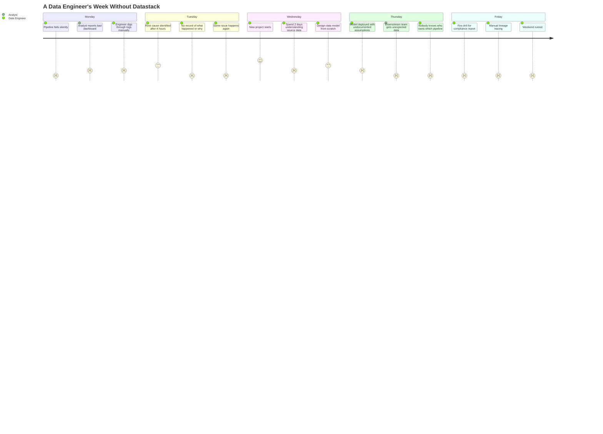
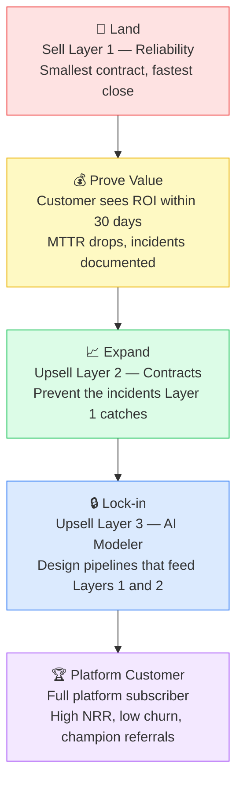
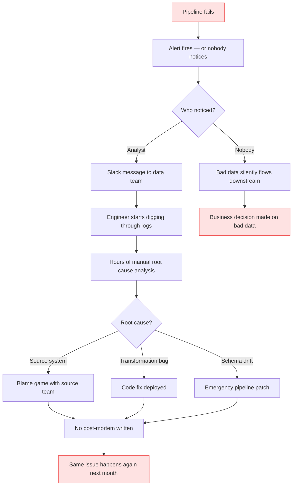
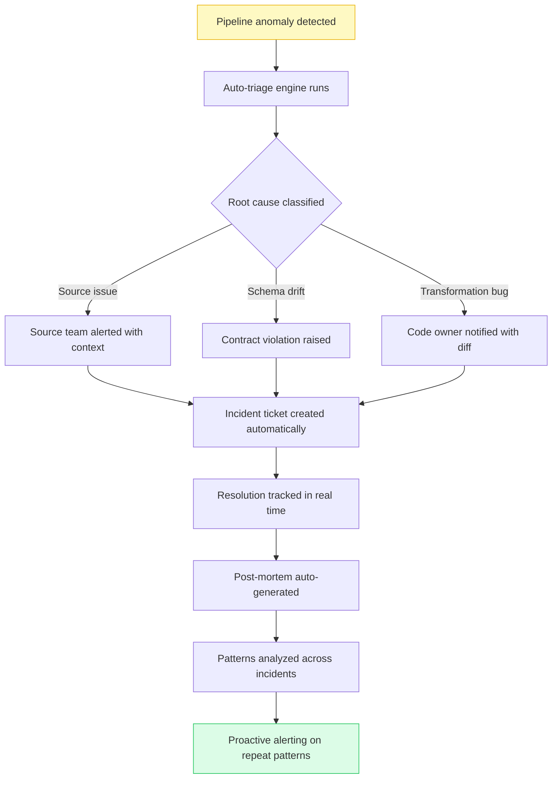
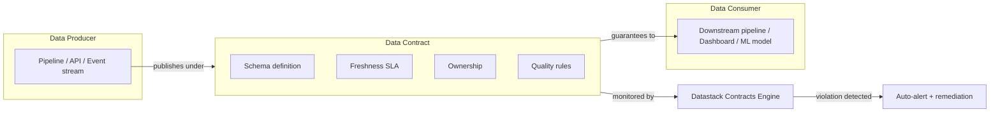
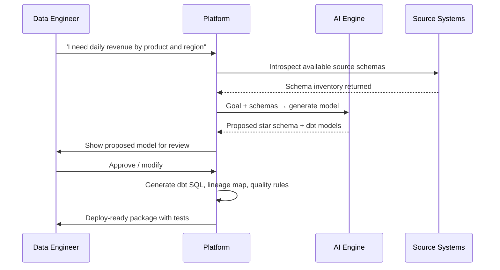
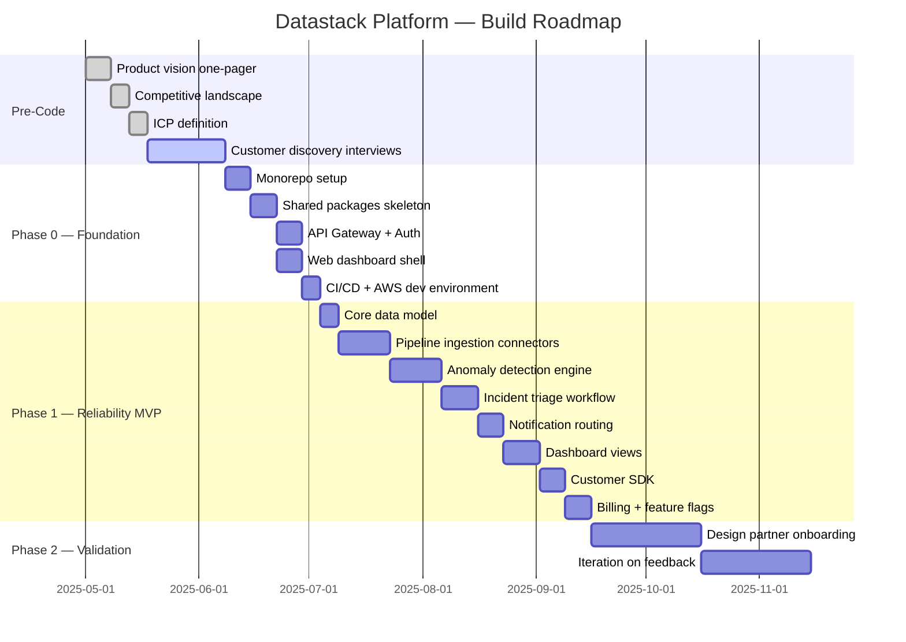

# Datastack Platform — Product Vision & Roadmap

---

## Vision Statement

> To become the operating system for data engineering teams — the single platform where data pipelines are monitored, governed, and designed — replacing the fragmented stack of point solutions that every team currently duct-tapes together.

---

## The Customer Journey

Every data team we've spoken to follows a predictable arc of pain:

---

## Product Strategy — The Wedge & Expand Model

We lead with the most acute pain (reliability), earn trust, then expand into governance and design. Each layer makes the previous one more valuable — creating compounding retention.

---

## Layer 1 — Data Reliability Platform

### Problem in Detail

When data pipelines fail today:

### What Datastack Reliability Does Instead

### Key Features — Layer 1

| Feature | Description | Priority |
|---|---|---|
| Pipeline inventory | Auto-discover pipelines from Airflow, dbt, Snowflake | MVP |
| Anomaly detection | Statistical + ML-based detection on pipeline metrics | MVP |
| Incident triage | Auto-classify root cause from signals | MVP |
| Notification routing | Route to right owner via Slack or email | MVP |
| Incident timeline | Full audit trail of what happened and when | MVP |
| Post-mortem generator | Auto-draft post-mortems from incident data | V2 |
| Runbook integration | Attach runbooks to recurring incident patterns | V2 |
| SLA tracking | Track pipeline SLAs and breach history | V2 |
| ML-based prediction | Predict failures before they happen | V3 |

---

## Layer 2 — Data Contract Platform

### The Core Concept

### Key Features — Layer 2

| Feature | Description | Priority |
|---|---|---|
| Contract definition UI | Schema, SLA, freshness, ownership in one place | MVP |
| Auto-test generation | Generate dbt tests from contract definitions | MVP |
| Compliance monitoring | Continuous contract health checks | MVP |
| Violation alerting | Notify producer on breach with context | MVP |
| Contract versioning | Track changes to contracts over time | V2 |
| Impact analysis | Show what breaks if contract changes | V2 |
| Auto-remediation | Quarantine bad data, pause dependent pipelines | V3 |

---

## Layer 3 — AI Data Model Generator

### The Workflow

### Key Features — Layer 3

| Feature | Description | Priority |
|---|---|---|
| Source introspection | Auto-read schemas from connected sources | MVP |
| NL-to-model | Plain language → proposed data model | MVP |
| dbt generation | Generate dbt models from approved design | MVP |
| Lineage mapping | Auto-document lineage end-to-end | MVP |
| Quality risk flags | Flag potential issues before deployment | V2 |
| Model versioning | Track model evolution over time | V2 |
| Feedback loop | Learn from engineer corrections | V3 |

---

## Build Roadmap

---

## Success Metrics

### Layer 1 Success (Signal to Activate Layer 2)
- 5+ paying mid-market customers
- Average MTTR reduction of >50% reported by customers
- Monthly churn < 5%
- At least 2 customer-initiated referrals

### Layer 2 Success (Signal to Activate Layer 3)
- 60%+ of Layer 1 customers upsell to Layer 2
- Contract violation detection rate > 90%
- Net Revenue Retention > 110%

### Platform Success
- 3+ modules adopted by at least 20% of customer base
- Annual contract value > $50K for platform customers
- NPS > 40 from data engineer users

---

*For technical implementation detail, see `03_TECHNICAL_ARCHITECTURE.md`*
