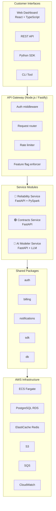
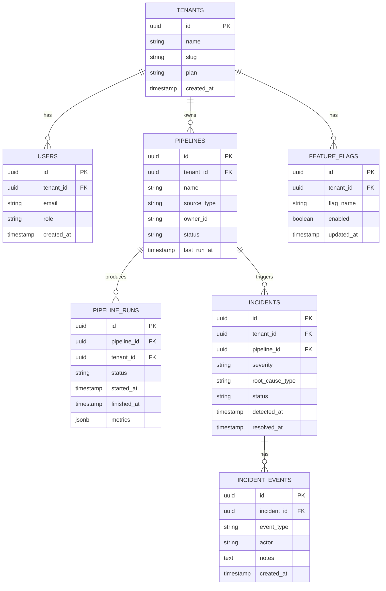
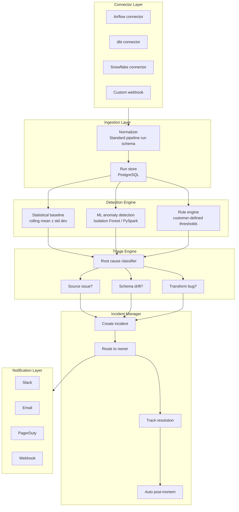
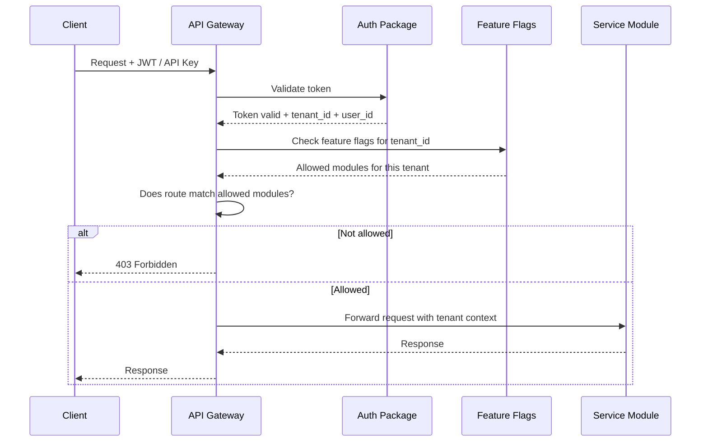
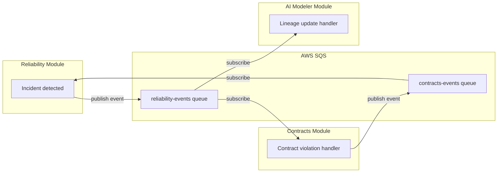
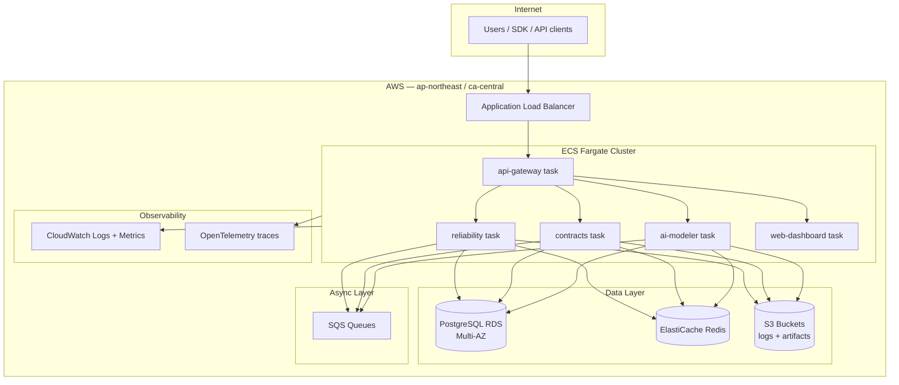
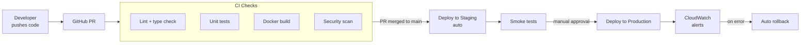
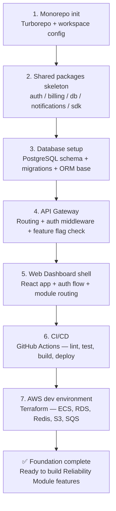

# Datastack Platform — Technical Architecture

---

## Overview

Datastack is built as a **monorepo** containing three independently deployable product modules and a shared platform foundation. All modules share the same authentication, billing, notification, and SDK layer. Customers purchase access to modules individually via feature-flagged subscriptions.

---

## High-Level Architecture



---

## Repository Structure

```
datastack-platform/                  ← monorepo root
│
├── apps/
│   ├── api-gateway/                 ← Node.js / Fastify
│   │   ├── src/
│   │   │   ├── routes/
│   │   │   ├── middleware/
│   │   │   │   ├── auth.ts
│   │   │   │   ├── feature-flags.ts
│   │   │   │   └── rate-limit.ts
│   │   │   └── index.ts
│   │   └── Dockerfile
│   │
│   ├── web-dashboard/               ← React + TypeScript + Vite
│   │   ├── src/
│   │   │   ├── modules/
│   │   │   │   ├── reliability/
│   │   │   │   ├── contracts/
│   │   │   │   └── ai-modeler/
│   │   │   ├── shared/
│   │   │   └── App.tsx
│   │   └── Dockerfile
│   │
│   ├── reliability/                 ← Python / FastAPI — ACTIVE
│   │   ├── src/
│   │   │   ├── api/
│   │   │   ├── detection/           ← anomaly detection engine
│   │   │   ├── triage/              ← root cause classifier
│   │   │   ├── connectors/          ← Airflow, dbt, Snowflake
│   │   │   └── main.py
│   │   ├── tests/
│   │   └── Dockerfile
│   │
│   ├── contracts/                   ← Python / FastAPI — SCAFFOLDED
│   │   └── src/
│   │       └── main.py              ← stub only
│   │
│   └── ai-modeler/                  ← Python / FastAPI — SCAFFOLDED
│       └── src/
│           └── main.py              ← stub only
│
├── packages/
│   ├── auth/                        ← JWT, API keys, OAuth
│   ├── billing/                     ← Stripe, feature flags
│   ├── notifications/               ← Slack, email, PagerDuty
│   ├── sdk/                         ← Python customer SDK
│   ├── db/                          ← schemas, migrations, ORM
│   └── shared-types/                ← TypeScript + Python types
│
├── infra/
│   ├── terraform/
│   │   ├── modules/
│   │   │   ├── ecs/
│   │   │   ├── rds/
│   │   │   ├── redis/
│   │   │   ├── s3/
│   │   │   └── sqs/
│   │   ├── environments/
│   │   │   ├── dev/
│   │   │   ├── staging/
│   │   │   └── prod/
│   │   └── main.tf
│   └── docker/
│
├── .github/
│   └── workflows/
│       ├── ci.yml
│       ├── deploy-staging.yml
│       └── deploy-prod.yml
│
├── docs/                            ← architecture decision records
├── CLAUDE.md                        ← Claude Code context file
├── turbo.json                       ← Turborepo config
└── package.json                     ← monorepo root
```

---

## Core Data Model

### Multi-tenancy First

Every table carries `tenant_id` from day one. No retrofitting later.



---

## Reliability Module — Internal Architecture



---

## Authentication & Authorization Flow



---

## Event-Driven Communication Between Modules

Modules never call each other directly. All cross-module communication flows through SQS events. This keeps modules loosely coupled and independently deployable.



---

## Infrastructure — AWS Architecture



---

## CI/CD Pipeline



---

## Tech Stack Summary

| Layer | Technology | Rationale |
|---|---|---|
| **Monorepo tooling** | Turborepo | Best-in-class for mixed Python/JS monorepos |
| **API Gateway** | Node.js + Fastify | Lightweight, fast routing, great TypeScript support |
| **Service modules** | Python + FastAPI | Founder's core language, excellent data ecosystem |
| **Anomaly detection** | PySpark + Scikit-learn | Distributed at scale, founder's deep expertise |
| **Frontend** | React + TypeScript + Vite | Industry standard, fast dev loop |
| **Styling** | TailwindCSS | Rapid UI development solo |
| **API data fetching** | TanStack Query | Best-in-class async state management |
| **Database** | PostgreSQL (RDS) | Relational, robust, multi-tenant friendly |
| **Cache / pub-sub** | Redis (ElastiCache) | Fast reads, pub-sub for live updates |
| **Async events** | SQS | Reliable, managed, decouples modules |
| **Object storage** | S3 | Logs, artifacts, pipeline snapshots |
| **Compute** | ECS Fargate | No Kubernetes overhead for a solo founder |
| **IaC** | Terraform | Reproducible, version-controlled infra |
| **CI/CD** | GitHub Actions | Free tier generous, tight GitHub integration |
| **Observability** | CloudWatch + OpenTelemetry | AWS-native + vendor-neutral tracing |

---

## Architectural Principles

| Principle | Implementation |
|---|---|
| **Multi-tenancy from day one** | `tenant_id` on every table, enforced in ORM base class |
| **Loose module coupling** | Modules communicate via SQS events only, never direct imports |
| **Feature flag access control** | Module access gated by `feature_flags` table per tenant |
| **Observability before features** | Logging, metrics, tracing configured in Phase 0, before any feature code |
| **Database isolation** | Each module owns its PostgreSQL schema, no cross-module joins |
| **Shared packages versioned independently** | Turborepo workspaces, each package has own `package.json` / `pyproject.toml` |
| **Deploy each module independently** | Separate ECS task definitions, separate Docker images, separate CI jobs |

---

## Phase 0 — What to Build First

Before any product features, the following foundation must exist:



---

*Questions? Raise an issue in Linear or review the session history in `CLAUDE.md`.*
