# The Problem We're Solving — A Technical Deep Dive

> Written for a technical audience. If you've worked in data engineering, you've lived
> every scenario in this document. This isn't a polished pitch deck — it's an honest
> breakdown of what's broken, why it stays broken, and exactly how we're fixing it.

---

## Before We Start — What This Is Really About

This isn't a document about bad tooling. The tools have gotten genuinely good. Airflow,
dbt, Snowflake, Spark — individually, each of these is a serious piece of engineering.

The problem is the **space between the tools**.

Every data engineer knows the feeling: you've got a beautiful dbt project, solid Airflow
DAGs, a clean Snowflake schema — and then something breaks at 2am, and you spend four
hours manually correlating logs across five different systems to figure out that someone
upstream renamed a column. The tools all did their job. The gap between them didn't.

That gap is what we're building for.

---

## The Numbers First — Then The Stories

Before the war stories, here's the scale of what we're describing:

| Metric | Data |
|---|---|
| Engineering time spent on pipeline maintenance | **53%** of total engineering hours |
| Annual cost of pipeline upkeep per org | **$2.2M** in engineer salary alone |
| Business impact of data downtime | **$49,600 per hour** |
| Estimated annual business impact per large org | **$36M+** |
| Data teams spending >50% of time on manual/repetitive tasks | **64%** of organizations |
| Data practitioners spending most of workday maintaining datasets | **57%** — unchanged year-over-year |
| Orgs with heavier workloads despite AI tool investment | **77%** |
| Orgs struggling with tool sprawl and fragmentation | **38%** |

> Sources: Fivetran Enterprise Data Infrastructure Benchmark 2026, Matillion Data
> Integration Survey 2025, dbt Labs State of Analytics Engineering 2025,
> MIT Technology Review / Snowflake Survey 2025.

These numbers aren't surprising if you've worked in this space. What's surprising is
that they haven't meaningfully improved in years — despite billions of dollars invested
in data tooling. That tells you the tools are not the root cause. Something structural
is broken.

---

## Problem 1 — Pipelines Break in the Dark

### The Scenario You've Definitely Lived

It's Monday morning. An analyst pings you on Slack: *"Hey, the revenue dashboard looks
weird — numbers are way down from last week."*

You open Airflow. The DAG shows green. You open dbt. Last run succeeded. You open
Snowflake. The table has data. Everything looks fine — until you actually query the
table and realize the `order_amount` column has been null for 48 hours, because someone
upstream renamed it from `order_value` on Saturday night. The transformation ran
successfully — it just silently selected null for every row.

The dashboard still loaded. The numbers were just wrong.

By the time you find this, it's 11am. The weekly leadership review happened at 9am.
Decisions were made on numbers that were fabricated by a broken pipeline.

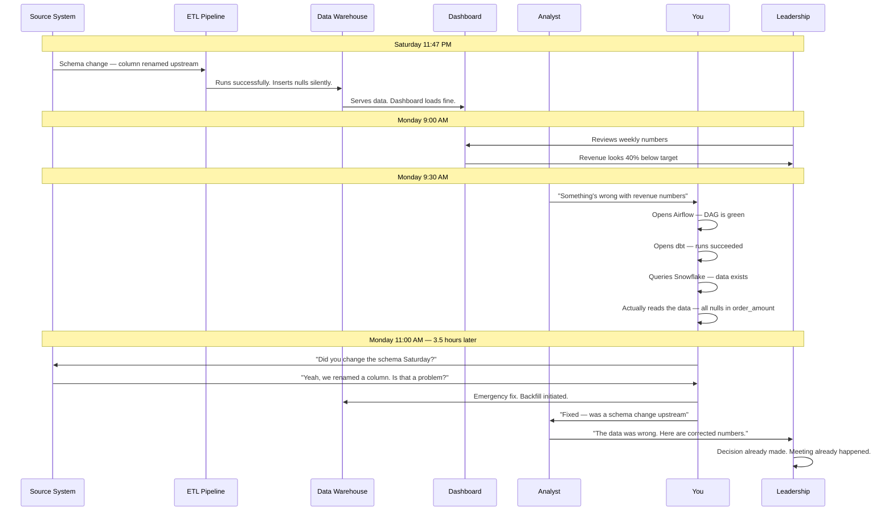

This plays out thousands of times a week across data teams globally. The frustrating
part isn't that it happened once — it's that **it will happen again next month**, with
a different column, a different upstream team, and the same four-hour investigation.

---

### Why This Keeps Happening — The Real Root Cause

The monitoring tools that exist today (Monte Carlo, Bigeye, Acceldata) solve the
detection problem partially. They will tell you that something looks anomalous. What
they don't do is answer the questions that actually matter when you're in the middle of
an incident:

- **What changed?** (Schema? Source data? Transformation logic? Infra?)
- **Who owns the system that changed it?**
- **What else is downstream of the broken table?**
- **Has this happened before? What fixed it last time?**

Answering those questions manually means opening four to six different tools, correlating
information that lives in separate systems, and doing archaeology on logs that weren't
designed to be cross-referenced. It is the data engineering equivalent of debugging a
distributed system without distributed tracing.

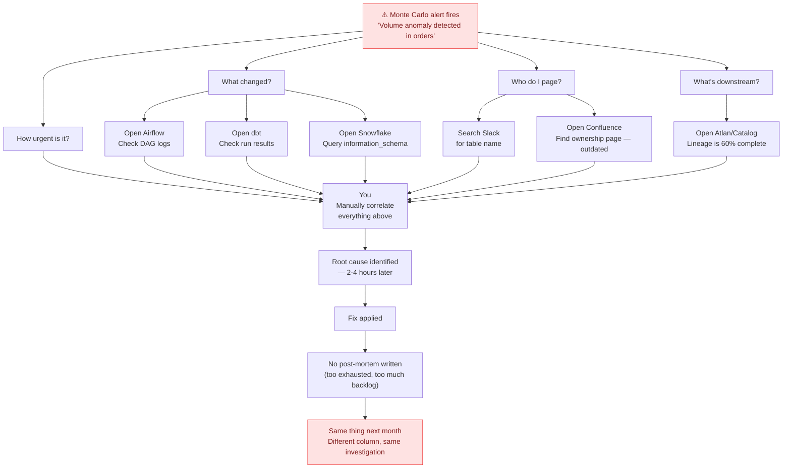

The alert is not the problem. The **absence of an incident response system** is the
problem. Software engineering solved this years ago — SRE practices, PagerDuty,
runbooks, post-mortems, on-call rotations. Data engineering has none of it, built for
its specific failure modes.

---

### What We're Building for Problem 1

The Datastack Reliability Engine is a purpose-built incident management system for data
pipelines. It doesn't replace your monitoring — it sits above it and answers the
questions that matter when something goes wrong.

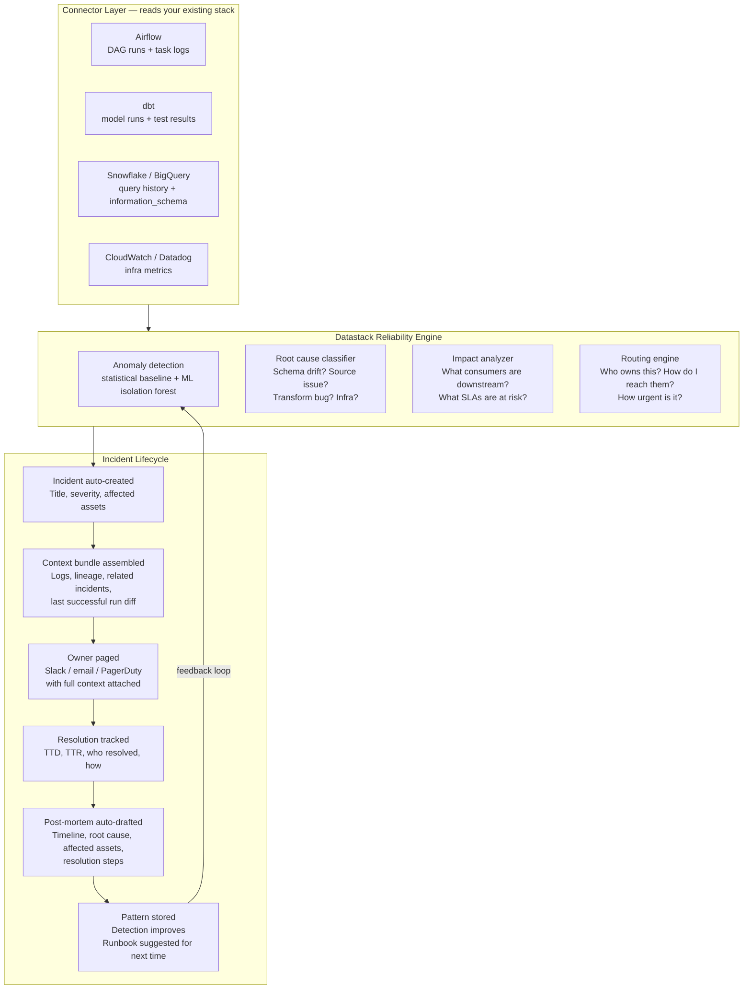

**The key difference:** when an incident fires in Datastack, the on-call engineer
receives a Slack message that already contains the root cause classification, the list
of affected downstream assets, the diff of what changed, the previous incident history
for this pipeline, and a suggested runbook. They do not start from zero.

```mermaid
gantt
    title MTTR Comparison — Before vs After Datastack Reliability
    dateFormat HH:mm
    axisFormat %H:%M

    section Without Datastack
        Pipeline fails silently       :done, b0, 02:00, 10m
        Analyst notices 7hrs later    :done, b1, 09:00, 30m
        Manual investigation begins   :done, b2, 09:30, 180m
        Root cause identified         :done, b3, 12:30, 30m
        Fix deployed                  :done, b4, 13:00, 60m
        Total time to resolution      :crit, btot, 02:00, 660m

    section With Datastack
        Pipeline fails                :done, a0, 02:00, 5m
        Anomaly detected              :done, a1, 02:05, 3m
        Root cause classified         :done, a2, 02:08, 2m
        Owner paged with full context :done, a3, 02:10, 20m
        Fix deployed                  :done, a4, 02:30, 30m
        Total time to resolution      :crit, atot, 02:00, 60m
```

---

## Problem 2 — The Handshake That Never Happens

### The Scenario

You've built a clean `orders_fact` table. Downstream of it: a finance report, two
analyst dashboards, a marketing attribution model, and an ML feature pipeline. You know
this because you built all of them. Your colleague doesn't know this, because it's not
written down anywhere.

Three months later, a new engineer on the source team "cleans up" the schema. They
remove a deprecated column — `legacy_order_type` — that had been marked deprecated for
six months. Nobody was using it, right?

Your ML feature pipeline was using it. It had been silently passing for six months
because the model was still in training, not yet in production. The day it went live in
production, it started predicting incorrectly — because one of its key features had
been null for three months.

Nobody connected these events for two weeks.

---

### The Structural Problem

In software engineering, this problem was solved decades ago: **APIs have contracts**.
A public API defines its interface, versions it, and breaking changes go through a
deprecation process with communication to all consumers. Consumers know what they can
depend on.

In data engineering, the equivalent of an API is a table or a dataset. And data tables
have no contracts. A producer can change anything at any time with no notification to
consumers, no versioning, and no migration process. Every consumer is one upstream
change away from a silent failure.

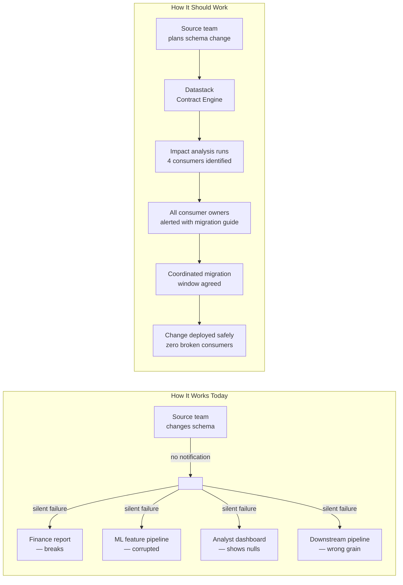

### What a Data Contract Actually Is

A data contract is a machine-readable specification that describes what a dataset is
supposed to look like and how it is supposed to behave. It lives alongside the data,
not in a wiki that nobody reads.

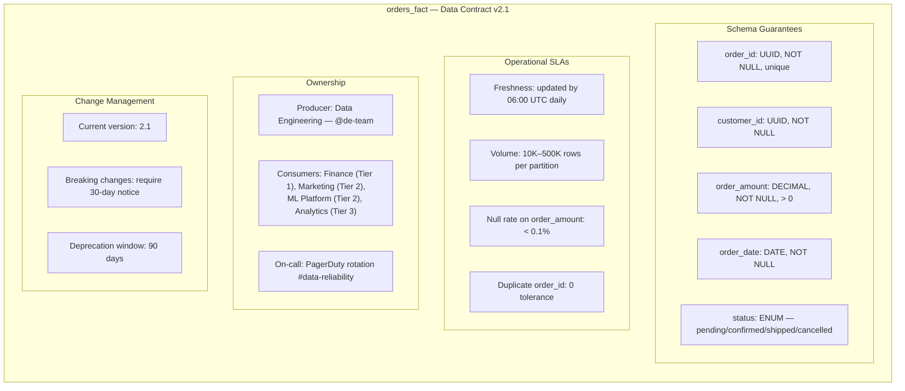

Datastack generates this contract from your existing dbt schema files and Snowflake
metadata — you don't start from a blank form. You review, fill in the gaps, and publish.
From that point, every pipeline run is validated against the contract automatically.

### What Happens When a Contract is Violated

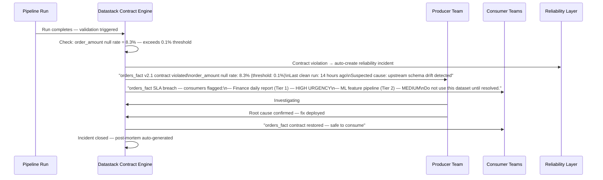

---

## Problem 3 — Every Project Starts at Zero

### The Scenario

You join a new team. There's a Confluence page that describes the data model, last
updated 18 months ago. Half the tables it references don't exist anymore. The engineer
who built it left the company. The dbt project has 200 models, minimal documentation,
and tests that haven't been updated since they were written.

You're asked to build a new data product: *"We need a way to see customer lifetime
value by acquisition channel, cohorted by month."*

You know roughly what this means. You spend two weeks:

- Figuring out which tables actually contain customer data (three candidates, each
  with different coverage)
- Understanding which transaction table is the authoritative one (two exist, reasons
  for duplication lost to history)
- Deciding on the grain (per customer? per customer-month? per cohort-month?)
- Designing the model (star schema? flat wide table? intermediate + final?)
- Writing the transformations from scratch
- Writing tests that may or may not actually cover the edge cases
- Documenting nothing because you're already behind

The model you produce is good — because you're good at this. But six months from now,
when you need to extend it or when someone asks why a number looks off, you'll be doing
archaeology on your own work.

---

### The Pattern-Matching Problem

Here is the uncomfortable truth about data modeling: **most of the decisions are not
novel**. An experienced data engineer looks at a set of source tables and a business
question and applies patterns they've learned over years:

- "This is a many-to-many with a bridge — model it as a fact with degenerate dimensions"
- "Customer events need a session grain before the order grain"
- "This SCD Type 2 history table needs surrogate keys, not natural keys"
- "The revenue metric needs to be at the order-line grain, not the order grain, or
  you'll double-count on refunds"

These decisions are not art — they are accumulated pattern recognition. And they are
largely transferable, because the underlying patterns (star schemas, SCDs, grain
declarations, surrogate vs natural keys) are well-established and well-documented.

What is not transferable today is the **application** of those patterns to a specific
set of source schemas in a specific business context. That requires a human, every
time, doing the same mental work from scratch.

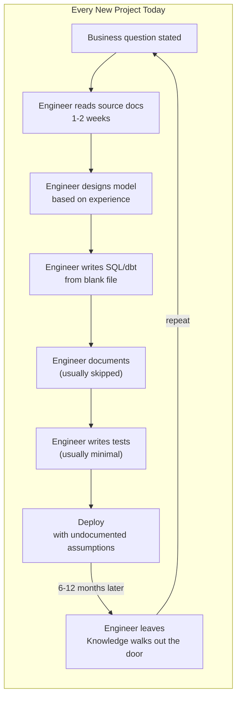

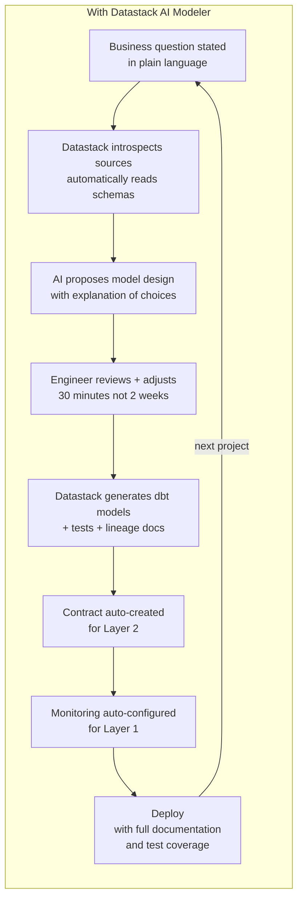

### What the AI Modeler Actually Does

This is not code generation in the way GitHub Copilot is code generation. Copilot
completes lines of code you've already started writing. The Datastack AI Modeler starts
from a business requirement, maps it to source data, makes architectural decisions, and
produces a complete, tested, documented data product.

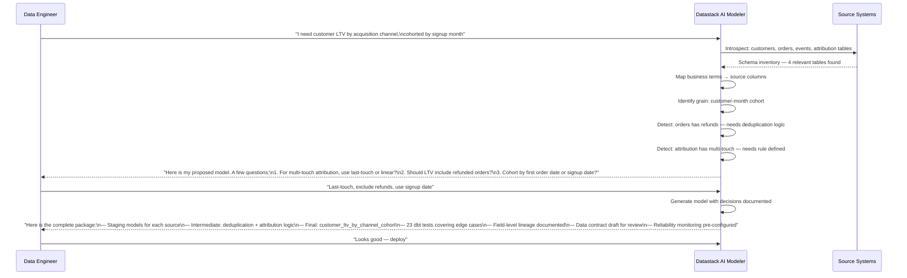

The questions the AI asks are the questions an experienced senior engineer would ask
before starting to write a single line of SQL. The difference is that the AI asks them
immediately, not after two weeks of work reveals that an assumption was wrong.

---

## The Fragmentation Root Cause — Why None of This Is Solved Yet

You might be wondering: Monte Carlo exists. dbt exists. Collibra exists. Great
Expectations exists. Why haven't these problems been solved?

The answer is that each of these tools solves exactly one layer — and they solve it
well. The problem is that the layers don't talk to each other in any meaningful way.
When a reliability incident fires in Monte Carlo, it doesn't know:

- What contract the affected pipeline was operating under
- What quality expectations were set by the data modeler
- Who the downstream consumers are and how urgently they depend on this data
- Whether this has happened before and what fixed it

It knows that something looks anomalous. Everything else requires manual investigation.

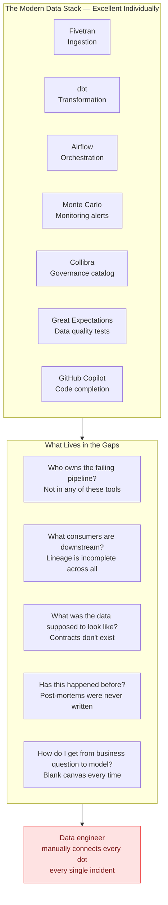

> **"83% of organizations have deployed AI-based data engineering tools. 38% are still
> struggling with tool sprawl and fragmentation. 77% say workloads are getting heavier,
> not lighter."**
> — MIT Technology Review / Snowflake, 2025

The tools are good. The architecture of how they connect is not. That's the market gap.

---

## The Solution Architecture — How the Layers Work Together

The deeper insight behind Datastack is that these three problems are not independent.
They are the same problem at three different points in the lifecycle:

- **Problem 3** (reinvention) happens at *design time*
- **Problem 2** (missing contracts) happens at *publish time*
- **Problem 1** (reliability chaos) happens at *runtime*

A platform that connects all three doesn't just solve each problem independently — it
creates compounding value that no point solution can replicate.

```mermaid
flowchart LR
    subgraph Design["Design Time\nLayer 3 — AI Modeler"]
        D1["Business question → proposed model"]
        D2["Architectural decisions documented"]
        D3["Tests generated automatically"]
        D4["Contract draft created"]
        D5["Quality rules embedded"]
    end

    subgraph Publish["Publish Time\nLayer 2 — Contracts"]
        P1["Contract versioned + published"]
        P2["Consumers registered"]
        P3["SLAs defined"]
        P4["Change process established"]
        P5["Tests auto-enforced on every run"]
    end

    subgraph Runtime["Runtime\nLayer 1 — Reliability"]
        R1["Continuous monitoring\nagainst contract spec"]
        R2["Anomaly auto-detected"]
        R3["Root cause auto-classified"]
        R4["Owner auto-paged with context"]
        R5["Resolution tracked"]
        R6["Post-mortem auto-generated"]
        R7["Pattern stored — system improves"]
    end

    Design -->|"contract draft flows into"| Publish
    Publish -->|"monitoring config flows into"| Runtime
    Runtime -->|"incident patterns improve"| Design

    style Design fill:#dbeafe,stroke:#3b82f6,color:#1e3a5f
    style Publish fill:#dcfce7,stroke:#22c55e,color:#14532d
    style Runtime fill:#fee2e2,stroke:#ef4444,color:#7f1d1d
```

### Shared Context — The Real Moat

When a reliability incident fires in Datastack, the system already knows:

1. **What the data was supposed to look like** — because the contract is in the same
   system
2. **Who the downstream consumers are and how urgent** — because consumer registration
   is part of the contract
3. **What architectural assumptions were made** — because the AI modeler documented
   them at design time
4. **Whether this has happened before** — because post-mortems are stored and
   searchable
5. **What the suggested fix is** — because runbooks are attached to recurring patterns

No combination of point solutions can provide this context automatically. It requires
a shared data model across the full lifecycle — which is only possible in a platform.

### The Feedback Loop

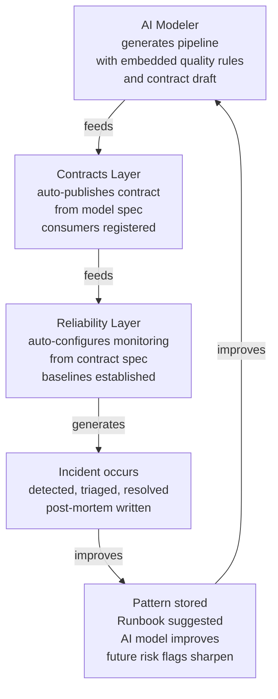

Every incident makes the next one faster to resolve. Every model designed through
Datastack makes the next model smarter. The longer a customer uses the platform, the
more value it creates — and the harder it is to replace with a point solution.

---

## What We Are Not Building

Worth stating explicitly, because scope discipline is everything for a two-person team:

| Not Building | Why |
|---|---|
| Another data catalog | Atlan and Collibra exist. We integrate, not replace. |
| Another orchestrator | Airflow/Prefect work fine. We read from them. |
| Another transformation tool | dbt is excellent. We generate dbt, not a dbt replacement. |
| Another ingestion tool | Fivetran/Airbyte handle this. Out of scope. |
| An observability tool | We use the signals from monitoring tools. We don't replace them. |
| A BI tool | Looker/Metabase are out of scope. We feed them clean data. |

We sit **above** the stack, connecting the layers. We are the operating system for data
reliability, governance, and design — not a replacement for any component of the stack.

---

## The Build Sequence — Why We Start with Reliability

Everything above argues for building all three layers simultaneously. We are not going
to do that.

We start with Layer 1 — Reliability — for one reason: **the pain is acute and visible
right now**. When a pipeline breaks, the engineer feels it today. When there are no
contracts, the pain is diffuse and accumulated. When models are built slowly, the waste
is invisible.

Acute pain is the easiest to sell. It is also the easiest to demonstrate value against:
before Datastack, MTTR was 4 hours. After, it's 30 minutes. That's a number a customer
will pay to maintain.

The wedge is Reliability. The expansion is Contracts. The lock-in is AI Modeling. Each
layer makes the others more valuable — and makes the platform harder to leave.

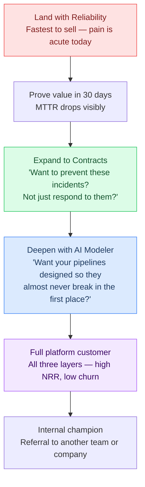

---

## What We Need from a Co-Founder

This document exists because we are looking for someone to build this with.

The technical architecture is defined. The build sequence is clear. What we are missing
is the other half of what makes a company work: the ability to find the first ten
customers, understand what they need more deeply than they can articulate themselves,
and translate that back into product direction.

We are not looking for a second engineer. We are looking for someone who has:

- Worked closely with data engineering teams — as a buyer, a seller, or a builder
- Understands the B2B SaaS sales motion at the early stage
- Has opinions about what the right first customer looks like and how to find them
- Is comfortable with a long game — we are building a platform, not a feature

If you've read this document and thought *"yes, I've lived this"* — that's a good sign.
If you've also thought *"here's what I'd change about how you framed the problem"* —
that's an even better one.

Let's talk.

---

*Technical architecture detail: `03_TECHNICAL_ARCHITECTURE.md`*
*Build roadmap and milestones: `02_PRODUCT_VISION_AND_ROADMAP.md`*
