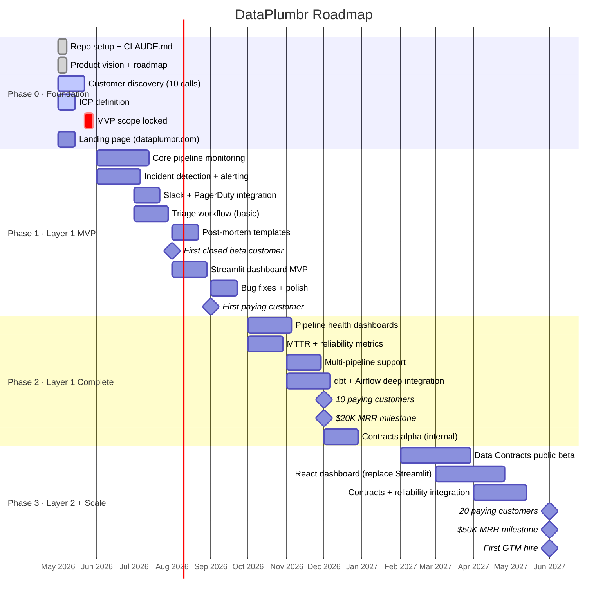
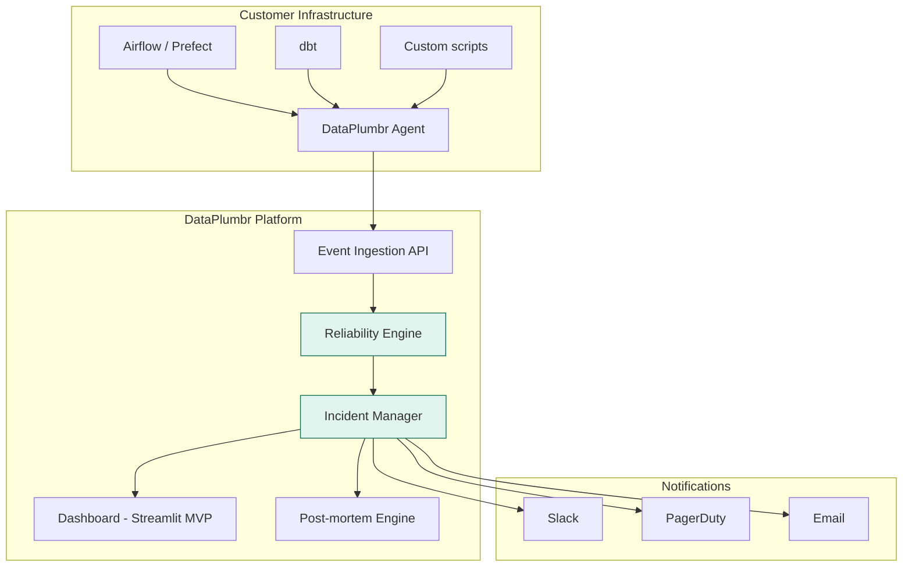
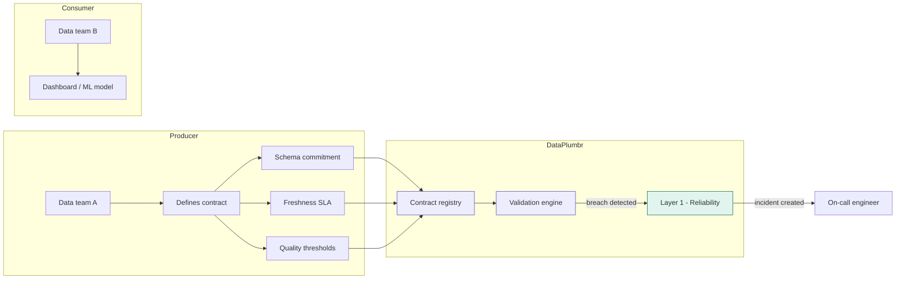
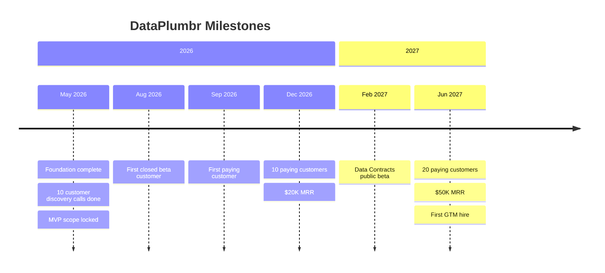

# DataPlumbr — Project Roadmap

> Solo founder. Lean. Intentional. No code before customer validation.

---

## Guiding Principles

- **Validate before building** — talk to 10 data engineers before writing a line of product code
- **Layer 1 must stand alone** — the Reliability Platform is a complete, sellable product on its own
- **Revenue funds Layer 2** — Data Contracts development begins only after Layer 1 generates consistent MRR
- **Stay in the gap** — every feature decision is filtered through the mid-market ICP, not enterprise aspirations

---

## Overview — Three Phases

---

## Phase 0 — Foundation

**Duration:** May 2026 (current)
**Status:** Active

This phase is complete when the product has been validated with real users and the MVP scope is locked. No product code until Phase 0 is done.

### Deliverables

| Task | Status | Notes |
|---|---|---|
| GitHub org `dataplumbr` created | ⬜ | Create org, two private repos |
| `dataplumbr` repo initialised | ⬜ | Monorepo structure, CLAUDE.md |
| `dataplumbr-site` repo initialised | ⬜ | Landing page repo |
| Product vision document | ✅ | This session |
| Roadmap document | ✅ | This session |
| CLAUDE.md (Cursor context) | ⬜ | Next — write with full context |
| Landing page live on dataplumbr.com | ⬜ | Coming soon page minimum |
| 10 customer discovery interviews | ⬜ | Talk to data engineers |
| ICP document (one page) | ⬜ | After first 5 interviews |
| MVP scope locked (one page) | ⬜ | After all 10 interviews |
| USPTO trademark search — DataPlumbr | ⬜ | tmsearch.uspto.gov, Class 42 |
| CIPO trademark search — Canada | ⬜ | opic.ic.gc.ca/tmdb |

---

## Phase 1 — Layer 1 MVP

**Duration:** June–September 2026
**Goal:** First paying customer. A working product that monitors pipelines and manages incidents.

### Architecture

### MVP Feature Scope (Layer 1)

**In scope for v0.1:**

- Pipeline run monitoring (start, success, failure, duration)
- Failure detection with configurable thresholds
- Slack alerting with basic context (what broke, when, which pipeline)
- Simple incident record (open, assigned, resolved)
- Post-mortem template (what broke, why, how to prevent)
- Single-tenant deployment per customer

**Explicitly out of scope for v0.1:**

- Column-level data quality checks (this is Soda/GE territory, not our entry point)
- Multi-pipeline dependency mapping
- React dashboard (Streamlit first, migrate later)
- Data Contracts (Layer 2)
- Any AI features (Layer 3)
- SSO / SAML
- SOC 2 certification

### Tech Stack (Phase 1)

| Component | Technology | Rationale |
|---|---|---|
| Core modules | Python 3.11 + FastAPI | Founder's primary language |
| API gateway | Node.js + Fastify | Performance layer |
| Database | PostgreSQL + TimescaleDB | Pipeline runs = time-series data |
| Cache | Redis (ElastiCache) | Session, pub/sub |
| Queue | AWS SQS | Async event processing |
| Dashboard | Streamlit | Python-native, no frontend skills needed |
| Compute | AWS App Runner | Simple, Docker-based, auto-scaling |
| CI/CD | GitHub Actions | Free for private repos |

### Success Criteria — Phase 1 Exit

- ✓ At least one paying customer
- ✓ Product monitors production pipelines reliably (≥99% uptime)
- ✓ Incident workflow used by a real team in a real incident
- ✓ Post-mortem captured and referenced by customer
- ✓ Net Promoter Score ≥ 8/10 from beta users

---

## Phase 2 — Layer 1 Complete

**Duration:** October–December 2026
**Goal:** 10 paying customers. $20K MRR. Layer 1 is the market-leading mid-market reliability platform.

### Key Additions

**Pipeline intelligence:**
- Historical reliability trends and MTTR tracking
- Recurring failure pattern detection
- Pipeline dependency mapping (which upstream failure caused which downstream failure)

**Deeper integrations:**
- dbt test failure → automatic incident creation
- Airflow task failure → incident with DAG context
- Prefect flow failure → incident with run metadata

**Team workflows:**
- On-call rotation management
- Escalation rules (unresolved after X minutes → page next person)
- Incident timeline (who did what and when)
- Slack threads linked to incident records

**Contracts alpha (internal only):**
- Basic producer-consumer agreement definition
- Schema validation against agreement
- Not customer-facing yet — building the foundation for Phase 3

### Success Criteria — Phase 2 Exit

- ✓ 10 paying customers across at least 3 different industries
- ✓ $20,000 MRR
- ✓ Average customer MTTR reduced by ≥30% vs pre-DataPlumbr baseline
- ✓ Zero customer churn from Phase 1 cohort
- ✓ Layer 2 alpha working internally on DataPlumbr's own data pipelines

---

## Phase 3 — Layer 2 + Scale

**Duration:** January–June 2027
**Goal:** 20 paying customers. $50K MRR. First hire. Data Contracts in public beta.

### Data Contracts (Layer 2)

**How contracts connect to Layer 1:**
A contract breach (late data, schema change, quality failure) automatically creates a Layer 1 incident. The producer's on-call engineer is paged. The incident includes the contract terms, the breach details, and the downstream impact. No alert sitting unread in a Slack channel — an incident with an owner, a deadline, and a post-mortem.

### React Dashboard Migration

The Streamlit dashboard (built for speed in Phase 1) is replaced with a React + TypeScript + Vite frontend. This is the point at which the product looks like the enterprise tool it's becoming.

### First Hire

At $50K MRR, the business can support a first hire. The right hire at this stage is not a second engineer — it's a sales/GTM person who has sold to data engineering teams before. Their job: talk to 50 prospects per month, close 5 per month. The founder focuses on product.

### Success Criteria — Phase 3 Exit

- ✓ 20 paying customers
- ✓ $50,000 MRR
- ✓ Data Contracts in public beta with at least 3 customers in production
- ✓ First GTM hire made and ramped
- ✓ Net revenue retention ≥ 110% (expansion from Layer 1 → Layer 2 upgrades)

---

## Milestone Summary

---

## Risk Register

| Risk | Likelihood | Impact | Mitigation |
|---|---|---|---|
| Discovery reveals wrong ICP | Medium | High | Do 10 interviews before any code |
| Layer 1 solo build takes longer than planned | High | Medium | Strict MVP scope, no scope creep |
| First customer churns before Phase 2 | Low | High | Weekly check-ins, be their on-call support |
| Competitor enters mid-market with better pricing | Medium | High | Speed to first 10 customers creates switching cost |
| No GTM motion without co-founder | High | High | Phase 3 hire solves this — survive to Phase 3 |

---

## What's Not On This Roadmap (Intentionally)

- SOC 2 certification — needed eventually, not before first 5 customers
- Enterprise sales motion — after Phase 3, not before
- International expansion — North America first, full stop
- Mobile app — data engineers work at desks
- A second technical co-founder — the product is buildable solo to $50K MRR

---

*DataPlumbr — dataplumbr.com | dataplumbr.dev*
*Roadmap version: May 2026 | Review cadence: monthly*
